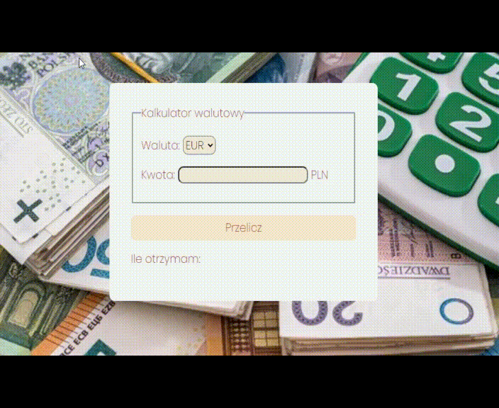

# Currency Conventer

# Demo
[See currency-converter](https://karolcia333.github.io/Currency-converter/)

# Description
I have created a simply currency converter. You can convert PLN into:
- EUR
- HUF
- CZK
## How to work
First you need to enter amount of money in PLN. Then you can select the currency from the list you want to convert into. Next you need to click the button "Przelicz" to get the result.

# Technologies used
- HTML
- Normalize
- CSS
- JavaScript
- ES6 + features
- Flexbox
- BEM convention
- GIT
- Markdown
